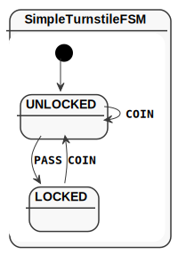
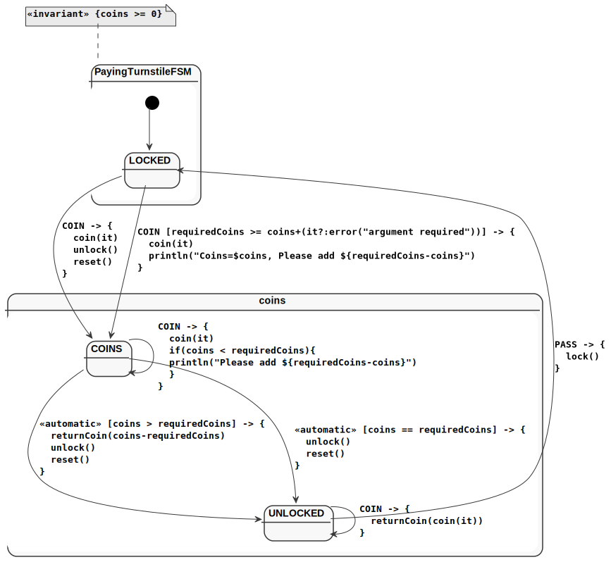
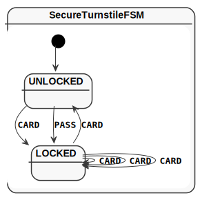

= KFSM Visualization

This work is licensed under link:https://www.apache.org/licenses/LICENSE-2.0.html[Apache License 2.0]

This project will explore many ways to visualize KFSM definitions.

This project require Kotlin Grammar Tools in order to parse the code containing the FSM.

I made changes to `https://github.com/Kotlin/grammar-tools` if the change had been merge the batch file change change to checkout
their version.

== Getting Started

[source,groovy]
-----
repositories {
    maven {
        url 'https://oss.sonatype.org/content/groups/public/'
    }
    mavenCentral()
}
dependencies {
    testImplementation 'io.jumpco.open:kfsm-viz:1.5.2.1'
}
-----

You can implement a test method to generate the required statemachine model artifacts, or you can configure the link:https://github.com/open-jumpco/kfsm-viz-plugin[kfsm-viz-plugin] for Gradle to produce visualizations.

=== PlantUML Statemachine Diagram

By parsing the source code we can extract the details of the guard expressions and actions.
This requires that you place one definition inside of one class.
There is a chance for the parser based solution to misbehave.
We request that you log an issue with the problematic FSM definition.

[source,kotlin]
----
@Test
fun produceVisualizationTurnstileFSM() {
    println("== TurnStile")
    val visualisation = parseStateMachine("TurnstileFSM", File("src/test/kotlin/Turnstile.kt"))

    File("generated-parsed", "turnstile.plantuml").writeText(plantUml(visualisation, true)) <1>

    File("generated-parsed", "turnstile-simple.plantuml").writeText(plantUml(visualisation, false)) <2>
}
----

<1> Detailed Included in State Diagram
<2> Detail like actions and guards ignored

=== AsciiDoctor State Table from VisualStatemachineDefinition

[source,kotlin]
----
@Test
fun produceVisualizationTurnstileFSM() {
    println("== TurnStile")
    val visualisation = parseStateMachine("TurnstileFSM", File("src/test/kotlin/Turnstile.kt"))
    File("generated-parsed", "turnstile.adoc").writeText(asciiDoc(visualisation))
}
----

== Generated from parsed VisualStateDefinition

We generated an asciidoc table as well as a plantuml statemachine model.

==== Simple Turnstile FSM

link:./src/test/kotlin/SimpleTurnstile.kt[SimpleTurnstile.kt]

===== Simple State Diagram

===== Detailed State Diagram

include::generated-parsed/simple-turnstile.adoc[]

==== Paying Turnstile FSM

link:./src/test/kotlin/PayingTurnstile.kt[PayingTurnstile.kt]

===== Simple State Diagram

===== Detailed State Diagram

include::generated-parsed/paying-turnstile.adoc[]

==== Secure Turnstile FSM

link:./src/test/kotlin/SecureTurnstile.kt[SecureTurnstile.kt]

===== Simple State Diagram

===== Detailed State Diagram

include::generated-parsed/secure-turnstile.adoc[]

==== Packer Reader FSM

link:./src/test/kotlin/PacketReader.kt[PacketReader.kt]

===== Simple State Diagram

===== Detailed State Diagram

image::packet-reader.svg[]

include::generated-parsed/packet-reader.adoc[]

== FAQ

=== What is with the semi-colons?

For guard expression we have decided the keep them on one line and we made the decision to print the implicit semi-colons to remove ambiguity.
